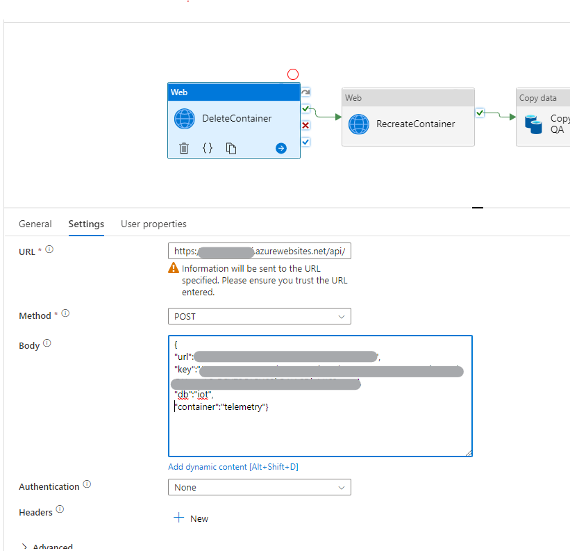

# Replicate Cosmos Data from one DB to another
This repo is intended to show how you can replicate a whole Cosmos Container from one DB to another. Typical use-cases for this are scenarios where data shall be replicated from Dev to Test or from Prod to Test. 

An alternative approach of this would be to restore the whole DB to another environment. But this is A) timeconsuming and B) requires a lot of managerial overhead such as setting permissions, network integration and connecting surrounding systems.

## Azure Function setup
The idea is to make use of the Cosmos API to drop and recreate a container before using ADF/Synapse to hydrate the new, empty container from the source DB. Initially the plan was to call the Cosmos API directly from ADF/Synapse. But due to the authentication process and additional required flexibility, a serverless Azure Function was put in-between.

If you're not familiar with deploying a python Azure Function, I recommend to first follow this [Quickstart](https://learn.microsoft.com/en-us/azure/azure-functions/create-first-function-vs-code-python?pivots=python-mode-configuration)

### Delete Container Function
The first function to call is the delete container function. This function is a POST call and requires the following parameters:

```json
{
  "url": "your_cosmos_endpoint",
  "key": "your_master_key",
  "db": "your_db_name",
  "container":"your_container_to_delete_name"
}
```

### Create Container Function
The create container functions requires the same payload as the above mentioned delete function, except the partition key. This is required if you want to create a new colletion:

```json
{
  "url": "your_cosmos_endpoint",
  "key": "your_master_key",
  "db": "your_db_name",
  "container":"your_container_to_delete_name",
  "partitionKey":"/your_partition_key"
}
```

## The pipeline
As described in the intro, the pipeline first deletes a container, recreated a container with the correct partitionKey and hydrates the data afterwards. In a nutshell, the pipeline looks like that:


In the respective Web activities, the calls to the Azure Function are handled.

For delete:


Where the url must point to your Azure Function with the DELETE url

For creating a new container:


Where the url must point to your Azure Function with the CREATE url

After this, you'll just have to call a simple copy activite that copies the whole container from your source to the destination (sink). 


If you're not familiar with this process, have a look at the following [documentation](https://learn.microsoft.com/en-us/azure/data-factory/connector-azure-cosmos-db?tabs=data-factory)